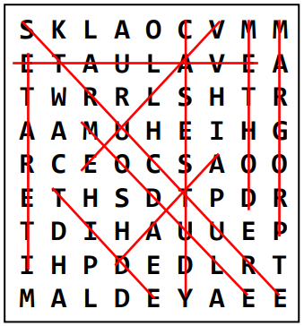

# Advanced Programming - Lab I (Final Lab)

The objective of this ACW is to develop program code in C++ to implement some alternative data structures for WordSearch puzzles, and related WordSearch dictionaries, and to investigate and report on their operational efficiency.

A WordSearch puzzle comprises a rectangular (normally square) grid of letters in which a number of words are hidden, and the goal of the puzzle is to find all the words present. The number of words hidden may or may not be specified, and the search may be aided by a dictionary of words to find, or it may be that the topic context is known (e.g., computer science) and the puzzler has to use their knowledge to decide what relevant words they can find.

The words may be hidden within rows and/or columns of the grid, and possibly diagonally, and possibly each in either direction (see illustration). Words may also cross over, so one letter cell in the grid may contribute to several target words.

If a dictionary is provided to support the searching, this may contain either the target words only, or the target words together with many other words to make the puzzle harder, or the enjoyment greater, depending on the puzzler’s point of view!

In this ACW, the puzzle grid can be assumed to be square. The size of the square is provided in the text file containing the puzzle. There will also be dictionaries of words to support the search in each puzzle grid. Therefore, the objective of the work is to develop and implement relevant data structures to represent the grid and the dictionary for each puzzle, and to evaluate the performance of these data structures in operation as your program solves each puzzle.



What will be the best data structures to represent the grid, and to hold the dictionary? Two alternative structures for each aspect are proposed for consideration, as described in more detail below. The puzzle Grid may be either a simple array of characters, or a linked structure of objects to hold puzzle-letter characters and links; the Dictionary may be an array of Strings or a tree structure of objects to hold wordletter characters and links.

You are required to develop a C++ program that implements the ‘simple’ array-based structures for Grid and Dictionary; and then to implement one of the more advanced linked-object-based alternatives. You should then add diagnostic code to report on the behaviour of the data structures while grid letter sequences are compared to dictionary contents in order to discover hidden words. Finally, you must then develop your formal report to review the different behaviours and consider their relative efficiency.

## Input and Output

Each grid puzzle will be in a text file called wordsearch_grid.txt and you are to implement code that can populate the grid of your data structure by reading the letters contained in the file. The data file consists of a single integer (n), followed by n * n letters, each in the range A-Z, for example see the grid on the right, corresponding to the example grid given earlier. You can assume that all letters and words provided are in upper-case format.

As you solve the puzzle using each variant of your program, you are to output a number of findings (described later) to a file called, as appropriate, either: `output_simple.txt` or `output_advanced.txt`

These files will be in the format specified in Appendix A.

A dictionary will be provided in `dictionary.txt.`

*Unseen puzzles and dictionaries will be used in the marking of this ACW and some diagnostics will be performed on your results file. Therefore, failure to use the correct file names and failure to output findings in the correct format will result in a loss of marks.*

## Structures for the Puzzle Grid

**(a)** The simplest structure for the puzzle grid is a 2D array of characters. This can be populated by reading from a given text data file (one line of characters per row of the grid) and traversed simply across rows (back and forth); by columns (up and down) and by diagonals (main and secondary, in either direction) by suitable use of loops or similar constructs, with appropriate adjustment of arrayindex values. From each grid position, your program should step along each direction in turn, comparing each letter sequence against the dictionary content to see if each sequence forms a word contained in the dictionary data. The simple puzzle’s size is defined in the text data file. However you can assume that it is always 9x9 for this assessment. The size will vary in the test puzzles for the advanced data structure (see below).

**(b)** A more advanced data structure recognises that any letter cell in the grid can form part of eight sequences (horizontal, vertical, and two diagonals, each of which may be read in either direction). Therefore, a data structure can be created based on individual ‘letter cell’ objects that are linked into sequences that can be uniformly checked by one standard comparison method. This comparison method would be invoked for each direction from each cell of the puzzle grid in turn, to compare the letter sequences from that point against the dictionary content. Regular row-by row traversal of this structure will remain possible (e.g., for data loading) by following the forward pointing horizontal links for each row, and the downward vertical links from the first cell in each row, starting from the top left corner. The advanced puzzle’s size is defined in the text data file, and is N x N where N is an integer value >= 9.

## Structures for the Dictionary

**(a)** The simplest structure for the dictionary is an array of strings (or std::vector<> of strings). This can be populated by reading from a text file (one line per word or string value) then searched systematically to match puzzle grid content as the letter sequences are traversed.

**(b)** A more advanced data structure recognises that many longer words may begin with the same letter sequence as (or the entirety of) some shorter word(s). For example, the dictionary may contain the words PROJECT and PROJECTOR, therefore PROJECTOR only requires two more letters matching than the word PROJECT. If the word matching process has to start each dictionary word string from the beginning, then such common sequences will be matched several times until the match is found or the search completely fails.

## Source-Code Development

Source code is required to define three of the above data structures (**two** simple and **one** advanced) and to operate the WordSearch solving process based on each of two combinations, i.e. simple grid and dictionary structures, followed by one simple and one advanced implementation. For each combination, the program must be run with each of the provided trial puzzles and dictionaries and in each case the operational timings must be recorded by use of suitably positioned timing statements. The number of words matched, the actual words matched, the total number of grid cells (puzzle letters) compared and the number of dictionary entries (or tree nodes) visited, along with the overall performance timings must be recorded. See Appendix A for the output format.

These observations should then be evaluated and discussed in your report, to derive conclusions with respect to relative operational behaviour of the different combinations of data structures as well the algorithms involved. The deliverables for the assessment will be:

- program source code in C++
- timing and activity results for each scenario combination of data structures
- discussion of results
- conclusions

## Provided Code and Files

A test harness has been provided to you. You **MUST** use this to test your implementation. If you do not implement the functionality of a particular method listed below, then simply output to the console (std::cout) a message stating that the particular method has not been implemented. You should assume that the given WordSearch class is not well designed C++, and so you will need to use Parasoft to make sure that your final source code does not violate any Parasoft rules. Parasoft will be used to mark the quality of your C++ implementation. Implement the following class and class methods:

### Class: WordSearch

#### Methods

`WordSearch()` - default constructor

`~WordSearch()` - destructor

`void ReadSimplePuzzle()` - This method will read the puzzle and store the letters in the simple grid data structure.

`void ReadSimpleDictionary()` - This method will then read the dictionary and store the words in the simple dictionary data structure.

`void ReadAdvancedPuzzle()` - This method will then read the puzzle and store the letters in the advanced grid data structure.

`void ReadAdvancedDictionary()` - This method will then read the dictionary and store the words in the advanced dictionary data structure.

`void SolvePuzzleSimple()` - This method will solve the puzzle using the simple grid data structure with the simple dictionary data structure.
 
`void SolvePuzzleAdvanced ()` - This method will solve the puzzle using the simple grid data structure with the advanced dictionary data structure, or using the advanced grid data structure with the simple dictionary data structure.

`void WriteResults()`- This method will take a string parameter that will represent the filename of the output file. This method will output the results from the previous `Solve()` method to the given output file, which will be either `results_simple_puzzle_simple_dictionary.txt` or `results_simple_puzzle_advanced_dictionary.txt` or `results_advanced_puzzle_simple_dictionary.txt`.

#### Constants

`puzzleName` - This constant holds the correct file name for the puzzle (e.g. wordsearch_grid.txt)

`dictionaryName` - This constant holds the correct file name for the dictionary (e.g. dictionary.txt)

Example puzzles are also available on GitHub

## Marking Scheme

A detailed marking scheme has been published on Canvas.

This marking scheme contains a breakdown of all of the marks and will give you the ability to mark yourself as you develop your software and write your lab book.

## Deliverables

### Code

You are to submit all of your code to the module Canvas site.

**BEFORE** you submit your code, make sure that you open your project in Visual Studio and then select `Build -> Clean Solution`

### Parasoft Results

Parasoft C++ Static Test results for your source code (in the form of an auto-generated HTML report)

### Lab Book

Create a new chapter (Lab I) in your lab book (maximum 2000 words), which contains:

- Timing and activity results, suitably tabulated for each scenario combination of data structures
- Discussion of results
- Conclusions
- [Optional] In some cases you might not agree with the Parasoft C++ Static Test results. This is
your opportunity to explain why you do not agree, and why the Parasoft rule does not apply to your
particular implementation.

Your discussion of results and conclusions should address the following topics:

- A brief review of the data structures you have implemented; how are they organised and how are they operated?
- For each combination of dictionary and puzzle data structure you have investigated, how does the performance compare with your alternative implementations (this discussion should make reference to your timing and activity results);
- Discuss whether it is more efficient to (a) select words from the dictionary and then search for them in the puzzle grid, or (b) visit each letter in the puzzle grid and attempt to match sequences from that position against the dictionary content. To what extent are these alternative approaches influenced by the alternative data structure strategies?

You will be required to run your code on a set of previously unseen test data, during the in-class test scheduled for the end of semester.

---

## Appendix A – Format of each results file

The following is the format of the results, and the heading names that you MUST have EXACTLY in your output file.

```
NUMBER_OF_WORDS_MATCHED n

WORDS_MATCHED_IN_GRID
n1 n2 WORD1
n1 n2 WORD2
etc.

WORDS_UNMATCHED_IN_GRID
WORDn
etc.

NUMBER_OF_GRID_CELLS_VISITED n

NUMBER_OF_DICTIONARY_ENTRIES_VISITED n

TIME_TO_POPULATE_GRID_STRUCTURE f

TIME_TO_SOLVE_PUZZLE f
```

The headings (in capitals) MUST appear in your results file as shown above.

The **n** items denote that this represents a single integer number

The **n1 n2 WORD1**, **n1 n2 WORD2** and **etc.** items denote that these represent all of the words matched in the grid - you will list all of the words here, one word per line.

The **n1** and **n2** before each matched word denotes the column/row position (starting at index 0) of the first letter of the word in the puzzle grid. For example, 0 2 HAND - denotes that the word HAND was found starting at column=0, row=2 (or x=0, y=2 of the grid).

The **f** items denote that this represents a single floating-point number in seconds.
